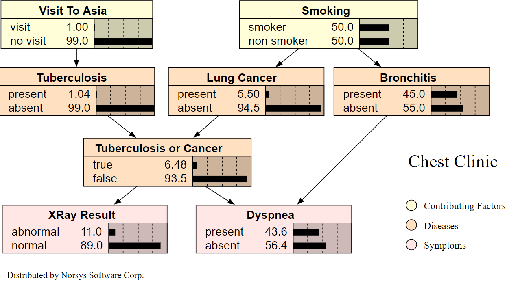

# ML-BOT-NAIVE-BAYES-DTS

For more information go to: http://www.norsys.com/netlibrary/index.htm

Our chosen Bayesian Network was:

• You can also access the Jupyter Notebook binder server of the current state of the project report by clicking on the binder laucher:

• 
